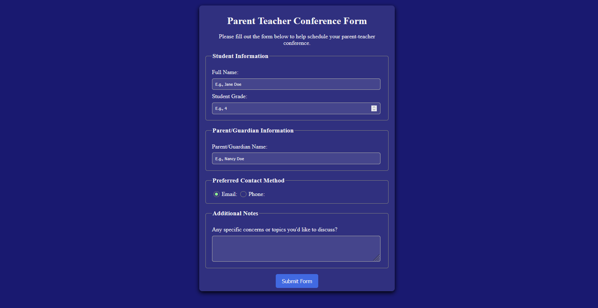

# Parent Teacher Conference Form

Formulaire de prise de rendez-vous parent-professeur, réalisé comme exercice CSS dans le cadre du cours *Responsive Web Design* de freeCodeCamp.

---

 

---

## Capture d'écran

> *capture d'écran à venir*

---

## Technologies

---

## Ce que j'ai appris

- **Sélecteurs CSS et combinateurs** — utilisation de sélecteurs descendants et de `:not()` pour cibler des éléments précis sans multiplier les classes.
- **Modèle de boîte (box model)** — distinction entre `margin` et `padding`, et impact de `width` sur la mise en page des champs de formulaire.
- **CSS externe et organisation** — séparation du HTML et du CSS dans des fichiers distincts, et avantages pour la lisibilité et la maintenance du code.

---

## Démo en ligne

🔗 [Voir le projet sur GitHub Pages](https://docaridr.github.io/parent-teacher-conference-form-freecodecamp)

---

## Auteur

Réalisé par **DocariDR** dans le cadre du parcours [freeCodeCamp — Responsive Web Design](https://www.freecodecamp.org/learn/responsive-web-design-v9/).